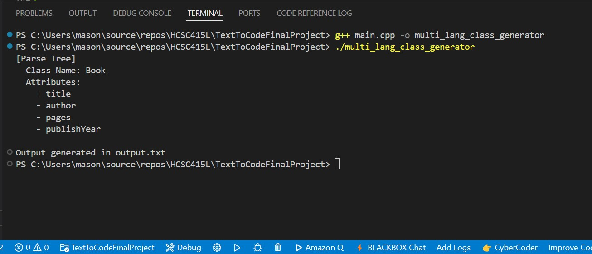

# Multi-Language Class Generator

This project is a **Text-to-Text** system written in C++ that reads a simple English command describing a class and generates equivalent **Python**, **C++**, and **Java** class code.  
It satisfies the requirements of a domain-specific language (DSL) by defining a clear input grammar, implementing a parser, and generating structured output in multiple programming languages.

---

## What's Included in This Version

This final version includes a working parser that:

- Accepts a simple English command describing a class
- Parses the class name and attributes from the command
- Generates valid class boilerplate code in **Python**, **C++**, and **Java**
- Outputs the result side-by-side in a `.txt` file
- Built entirely in C++ using standard libraries

---

## **Features**

✔️ Supports English input like:

- `"Create a class called Student with name and GPA and populate those fields"`
- `"Create a class called Book with title, author, pages, and publishYear and populate those fields"`

✔️ Outputs:

- Python class with an `__init__` constructor
- C++ class with public string attributes
- Java class with public string attributes

✔️ Prints a readable Parse Tree to the terminal

✔️ Outputs success confirmation to the terminal

---

## **Files Overview**

- **`main.cpp`** – Handles input parsing, code generation, and output
- **`input.txt`** – Contains the English command to be parsed
- **`output.txt`** – Generated classes in Python, C++, and Java

---

## **How It Works**

### Input (`input.txt`)

```text
Create a class called Book with title, author, pages, and publishYear and populate those fields
```

### Output (`output.txt`)

```text
# Python
class Book:
    def __init__(self):
        self.title = None
        self.author = None
        self.pages = None
        self.publishYear = None

# C++
class Book {
public:
    std::string title;
    std::string author;
    std::string pages;
    std::string publishYear;
};

# Java
public class Book {
    public String title;
    public String author;
    public String pages;
    public String publishYear;
}
```

---

## **Grammar Overview**

The input command follows this basic pattern:

```
<command> ::= "Create a class called" <ClassName> "with" <AttributeList> "and populate those fields"
<AttributeList> ::= <Attribute> | <Attribute> "," <AttributeList> | <Attribute> "and" <AttributeList>
```

---

## **Installation & Setup**

1. **Compile the Program**:

   ```bash
   g++ main.cpp -o multi_lang_class_generator
   ```

2. **Run the Executable**:

   ```bash
   ./multi_lang_class_generator
   ```

3. **View the Output**:

   - Open `output.txt` to see the generated Python, C++, and Java classes.

---

## **Assumptions & Design Decisions**

- The input follows the expected format (starts with "Create a class called ... with ... and populate those fields")
- All attributes are treated as strings for simplicity
- The generator does not handle methods or complex class structures yet
- Attributes are initialized to `None` in Python, and declared as `std::string` / `String` in C++/Java

---

## **Application Screenshots**:

### Input File – `input.txt`

  
This shows the original C++ class declaration written in `input.txt`.

---

### Output File – `output.txt`

  
This shows the Python class generated by the parser after translating the input written in `output.txt`.

---

## Terminal Output (Parse Tree) - `terminal`


This shows the parse tree that the program uses, as it's shown in the terminal.

---

## Author

- Mason Brown
- Morehouse College - Computer Science
