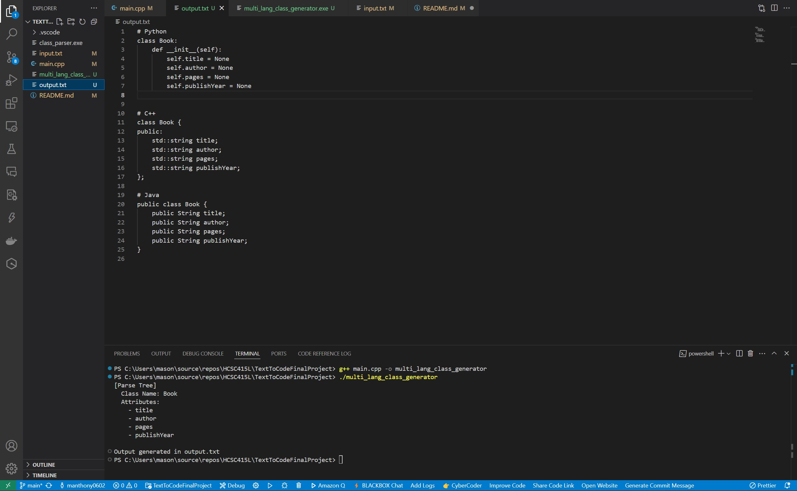

# Text-to-Python Parser Project

This project is a **Text-to-Text** system written in C++ that parses a simplified C++ class declaration and converts it into an equivalent Python class. It satisfies the requirements of a domain-specific language (DSL) by defining a clear input grammar, implementing a parser, and generating structured output in a different programming language.

---

---

## What's Included in This Version

This final version includes a working parser that:

- Accepts a C++ class declaration in a simplified format
- Parses class name, attributes, and methods using a recursive parser
- Generates a valid Python class with constructor and method stubs
- Outputs the result in a new `.py` file
- Built entirely in C++ using standard libraries

---

---

## **Features**

✔️ Supports simplified C++ syntax with:

- `class ClassName { ... };`
- Only `public` members
- Attributes with types like `int`, `string`, `float`, `bool`
- Methods declared as `void methodName();`

✔️ Outputs Python class with:

- `__init__()` constructor initializing attributes
- Empty method stubs using `def` and `pass`
- Type-to-default-value mapping logic

✔️ Prints success confirmation to the terminal

---

---

## **Files Overview**

- **`main.cpp`** – Tokenizer, parser, and Python code generator logic
- **`input.txt`** – Contains the C++ class declaration to be translated
- **`output.py`** – Generated Python class based on the parsed input

---

---

## **How It Works**

### Input (`input.txt`)

```cpp
class Person {
public:
    string name;
    int age;
    void greet();
};
```

### Output (`output.py`)

```py
class Person:
    def __init__(self):
        self.name = ""
        self.age = 0

    def greet(self):
        pass

```

---

---

## **Grammar Definiton (BNF)**

```
<program> ::= <class_decl>
<class_decl> ::= "class" <identifier> "{" <public_block> "};"
<public_block> ::= "public:" <member_list>
<member_list> ::= <member> | <member> <member_list>
<member> ::= <attribute_decl> | <method_decl>
<attribute_decl> ::= <type> <identifier> ";"
<method_decl> ::= "void" <identifier> "(" ")" ";"
<type> ::= "int" | "float" | "string" | "double" | "bool"
<identifier> ::= <letter> <identifier_rest>
<identifier_rest> ::= "" | <letter_or_digit> <identifier_rest>
```

---

## How the Grammar Maps to the Parser

Each BNF rule corresponds to a logic section in the C++ parser:

- `<class_decl>` → Recognized by looking for "class" and capturing the name
- `<public_block>` → Detected with the "public:" keyword
- `<attribute_decl>` → Parsed by matching types like `int`, `string`, etc., followed by an identifier
- `<method_decl>` → Detected using the "void" keyword and structured around `void name();`
- The tokenizer ensures `(`, `)`, and `;` are properly separated to match grammar expectations

These patterns are handled in the `parseClass()` function using a top-down, recursive style.

---

---

## **Installation & Setup**

1. **Compile the Program**:

   ```sh
   g++ main.cpp -o class_parser

   ```

2. **Run the Executable**:

   ```bash
   ./class_parser
   ```

3. **View the Output**:

   - Open `output.py` to see the generated Python class.

---

---

## **Assumptions & Design Decisions**:

- The program assumes the input class is syntactically correct
- Only handles basic class structures—no inheritance, private/protected, or complex types
- Methods must be void with no parameters
- Types are mapped to Python with default values:
  `int → 0, bool → False, string → "", etc.`

---

---

## **Application Screenshots**:

### 📄 Input File – `input.txt`

  
This shows the original C++ class declaration written in `input.txt`.

---

### 🐍 Output File – `output.py`

  
This shows the Python class generated by the parser after translating the input.

---

---

## Author

- Mason Brown
- Morehouse College - Computer Science
